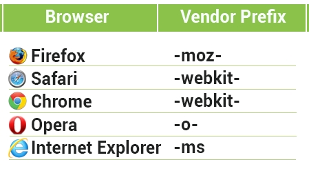

# Conceptos básicos
## Prefijos de navegación

Son una forma en la que los fabricantes de navegadores añaden soporte a las nuevas características de css en periodos de prueba o experimentación.

Por ejemplo, el prefijo de Safari y Chrome es -webkit-. 
``` css 
    .cuadrado {
        -webkit-border-radius: 10px;
    }
```
La mayoría de navegadores de hoy en día funcionan sin prefijos, pero es esencial conocerlos para la compatibilidad y entendimiento de códigos antiguos.

Escribir varias veces las propiedades para que funcionen en diferentes navegadores puede ser molesto pero es temporal. Mientras los navegadores mejoran, añadirán soporte a las propiedades y eliminaran los prefijos.



<hr>

##  border-radius
Podemos darle esquinas redondeadas a cualquier elemento.
``` css
    .div{
        width: 200px;
        height: 200px;
        background-color: orangered;
        border-radius: 50px;
    }
```

<a href="assets/examples/00border-radius.html" target="_blank">Ejecutar código</a>

Podemos especificar el radio de cada esquina en orden: superior-izquierdo, superior-derecho, inferior-derecho, inferior-izquierdo.

``` css
    .div{
        width: 200px;
        height: 200px;
        background-color: orangered;
        border-radius: 0 0 0 50px;
    }
```
<a href="assets/examples/01border-radius.html" target="_blank">Ejecutar código</a>

Una caja puede ser convertida en un círculo solo usando CSS. El radio debe ser la mitad del ancho y alto de la caja.
``` css
    .div {
        width: 200px;
        height: 200px;
        border-radius: 100px;
    }
```
<a href="assets/examples/02border-radius.html" target="_blank">Ejecutar código</a>

## box-shadow

La propiedad CSS3 box-shadow permite aplicar sombras a los elementos.    
Los parámetros de esta propiedad son:
- Desplazamiento horizontal: Desplaza la sombra hacia la derecha. (Requerido)
- Desplazamiento vertical: Desplaza la sombra hacia abajo. (Requerido)
- Color: Color de la sombra. (opcional)

``` css
    .div {
        width: 300px;
        height: 100px;
        background-color: orangered;
        box-shadow: 10px 10px grey;
    }
```
<a href="assets/examples/03box-shadow.html" target="_blank">Ejecutar código</a>

Adicionalmente, hay dos propiedades opcionales; **Blur**(desenfoque) y **Spread**(propagación).      
Estos valores se añaden antes de asignar el color.

``` css
    .div {
        width: 300px;
        height: 100px;
        background-color: orangered;
        box-shadow: 10px 10px 5px 5px grey;
    }
```
<a href="assets/examples/04box-shadow.html" target="_blank">Ejecutar código</a>