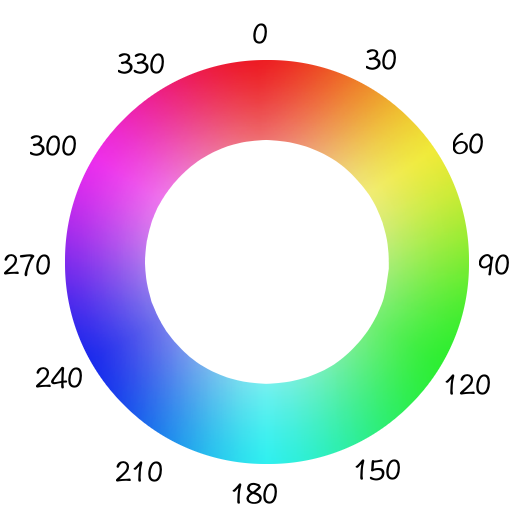

# Filtros

### Menú de navegación

<ul>
    <li><a href="#filter">filter</a></li>
    <ul>
        <li><a href="#drop-shadow">drop-shadow</a></li>
        <li><a href="#grayscale">grayscale</a></li>
        <li><a href="#sepia">sepia</a></li>
        <li><a href="#saturate">saturate</a></li>
        <li><a href="#hue-rotate">hue-rotate</a></li>
        <li><a href="#invert">invert</a></li>
        <li><a href="#opacity">opacity</a></li>
        <li><a href="#brightness">brightness</a></li>
        <li><a href="#contrast">contrast</a></li>
        <li><a href="#blur">blur</a></li>
        <li><a href="#multiples-filtros">Múltiples filtros</a></li>
    </ul>
</ul>

<a name="filter"></a>

## filter

La propiedad de CSS **filter** permite aplicar efectos gráficos como desenfoque o cambios de color en un elemento.

El filtrado de imágenes es útil cuando quieres tener estilos diferentes de la misma imagen. En vez de subir múltiples imagenes a la web, puedes subir una sola y definir efectos visiales con la propiedad filter.

<a name="drop-shadow"></a>

#### drop-shadow

**drop-shadow(alto, ancho, desenfoque color)** crea un efecto de sombra. El alto, ancho y desenfoque son valores expresados en pixeles.

``` css
    img {
        filter: drop-shadow(5px 5px 3px blue);
    }
```
<a href="assets/examples/46drop-shadow.html" target="_blank">Ejecutar código</a>

<a name="grayscale"></a>

#### grayscale

La función **grayscale** convierte una imagen a escala de grises. Su único parámetro define la proporción de la conversión.

**0%** grayscale es la imagen original, mientras que **100%** hace que la imagen esté completamente en escala de grises.

``` css
    img {
        filter: grayscale(100%);
    }
```
<a href="assets/examples/47grayscale.html" target="_blank">Ejecutar código</a>

<a name="sepia"></a>

#### sepia

Convierte una imagen a sepia. Es similar a la escala de grises pero en un tono de color **marrón-rojizo**. La idea de los filtros sepia es que pueden hacer las fotos en blanco y negro sean un poco más atractivas.

**0%** sepia es la imagen original y **100%** es totalmente sepia.

``` css
    img {
        filter: sepia(100%);
    }
```
<a href="assets/examples/48sepia.html" target="_blank">Ejecutar código</a>

<a name="saturate"></a>

#### saturate

Controla la **saturación de color** de una imagen. El parámetro puede ser un valor porcentual o numérico.

**0%** o **0** crea una imagen sin saturación y **100%** o **1** es la imagen original.

``` css
    .img {
        filter: saturate(2);
    }
```
<a href="assets/examples/49saturate.html" target="_blank">Ejecutar código</a>

<a name="hue-rotate"></a>

#### hue-rotate

Aplica una rotación al matiz (basada en un circulo de color) a una imagen. El parámetro de la función es un ángulo de rotación.



Si la imagen contiene color rojo, el cual se encuentra en 0 grados, rotar la matiz 90 grados hará que el color se vuelva verde.

``` css
    .img {
        filter: hue-rotate(90deg);
    }
```
<a href="assets/examples/50hue-rotate.html" target="_blank">Ejecutar código</a>

<a name="invert"></a>

#### invert

Invierte los colores de una imagen para volver **claras las áreas oscuras** y **las oscuras en áreas claras**. El parámetro puede ser un valor porcentual o numérico.

**0%** deja la foto igual y **100%** crea una imagen totalmetne invertida. Se permiten valores superiores al 100% pero no se modificará la imagen más alla del 100%.

``` css
    .img {
        filter: invert(100%);
    }
```
<a href="assets/examples/51invert.html" target="_blank">Ejecutar código</a>

<a name="opacity"></a>

#### opacity

Establece la opacidad de una imagen para cambiar su transparencia. 

**0%** crea una imagen transparente y **100%** crea una imagen opaca.

``` css
    .img {
        filter: opacity(30%);
    }
```
<a href="assets/examples/52opacity.html" target="_blank">Ejecutar código</a>

<a name="brightness"></a>

#### brightness

Ajusta el brillo de la imagen haciendo que aparezca más brillante u oscura. El parámetro puede ser un valor porcentual o numérico.

**0%** crea una imagen oscura, **100%** es la imagen original y cualquier valor **superior a 100%** crea una imagen más brillante.

``` css
    .img {
        filter: brightness(50%);
    }
```
<a href="assets/examples/53brightness.html" target="_blank">Ejecutar código</a>

<a name="contrast"></a>

#### contrast

Ajusta el contraste de una imagen. El parámetro puede ser un valor porcentual o numérico.

Un valor **inferior a 100%** disminuye el contraste, mientras que **uno superior lo aumenta**.

``` css
    .img {
        filter: contrast(150%);
    }
```
<a href="assets/examples/54contrast.html" target="_blank">Ejecutar código</a>

<a name="blur"></a>

#### blur

Aplica un efecto de desenfoque en la imagen. El parámetro no acepta valores porcentuales.

``` css
    .img {
        filter: blur(3px);
    }
```
<a href="assets/examples/55blur.html" target="_blank">Ejecutar código</a>

<a name="multiples-filtros"></a>

#### Múltiples filtros

Se pueden especificar múltiples filtros separandolos con espacios.

``` css
    .img {
        filter: saturate(1.5) brightness(1.2) drop-shadow(5px 5px 3px grey);
    }
```
<a href="assets/examples/56multiples-filtros.html" target="_blank">Ejecutar código</a>